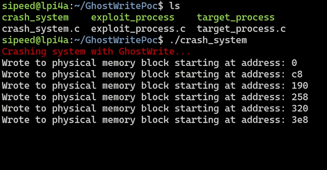
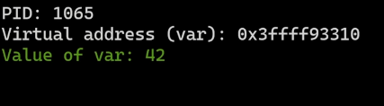
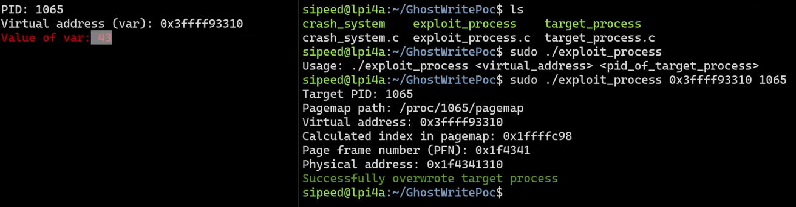

.. _beaglev-ahead-ghostwrite-exploit:

GhostWrite Exploit (CVE-2023-4966)
##################################

Introduction
************

.. warning::
    This tutorial is for educational and research purposes only. The information and code
    provided should only be used on systems you own or have explicit permission to test.
    Unauthorized access to computer systems is illegal.

This tutorial demonstrates how to run a Proof-of-Concept (PoC) exploit for the `GhostWrite <https://ghostwriteattack.com/>`
vulnerability (CVE-2023-4966) on the BeagleV-Ahead board. This exploit is due to faulty
instructions in the vector extension of the XuanTie C910 and C920 cores.

Hardware Requirements:
======================

1. BeagleV-Ahead board running a Linux distribution (e.g., Debian).
2. Ethernet cable and network connection.

Software Requirements:
======================

1. Git to clone the exploit repository.
2. GCC to compile the exploit code.
3. The exploit code from `LaurieWired/GhostWriteExploit <https://github.com/LaurieWired/GhostWriteExploit>`_.

Start Exploitation
******************

.. note:: 
    
    The following steps assume you are running a standard Linux distribution on your BeagleV-Ahead board and have a shell open.

In the exploit PoC, you will find two folders:

1. `CrashSystem` - Repeatedly writes random data to physical memory, ultimately causing the system to crash.
2. `OverwriteProcess` - Uses access to physical memory to change the memory of another running process.

CrashSystem Exploit
===================

To compile and run the CrashSystem exploit code, follow these steps:

.. code-block:: bash

    cd CrashSystem
    gcc crash_system.c -o crash_system -march="rv64gzve64x"

    # Run the exploit
    ./crash_system

You will see the system crash as expected.

    Demonstration of the GhostWrite exploit running on BeagleV-Ahead.

OverwriteProcess Exploit
========================

To compile and run the OverwriteProcess exploit code, follow these steps:

.. code-block:: bash

    cd OverwriteProcess
    gcc exploit_process.c -o exploit_process -march="rv64gzve64x"
    gcc target_process.c -o target_process -march="rv64gzve64x"

    # Run the target process
    ./target_process

You will see the memory of the target process running and printing the value 42.

    Target process running and printing the value 42.

Now, run the exploit process:

.. code-block:: bash

    ./exploit_process

You will see the memory of the target process being overwritten with the value 43.

    Exploit process running and overwriting the target process.

You can see that after specifying the virtual address of the target process and the PID, we
were able to successfully overwrite the memory of the target process with the value 43.
This is all done without any privilege escalation.

Mitigation
**********

The only mitigation for this exploit is to disable the vector extension. However, doing so will
negatively impact the performance of the system.
