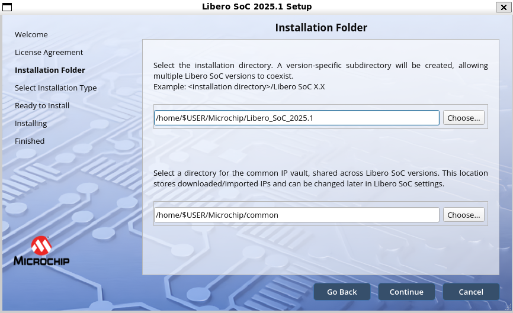
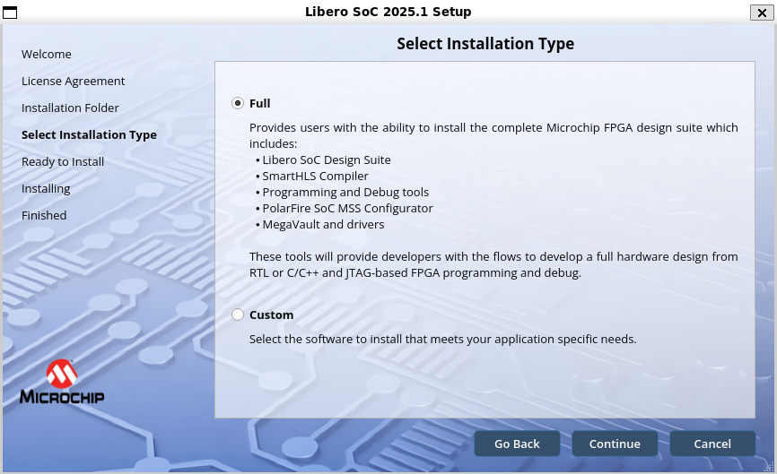
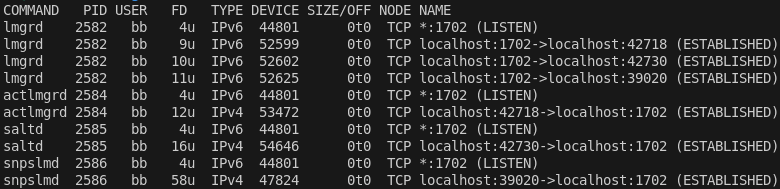

.. _beaglev-fire-mchp-fpga-2025-1-tools-installation-guide:

Microchip 2025.1 FPGA Tools Installation Guide
##############################################

Instructions for installing the Microchip FPGA tools on a Ubuntu 20.04 or 22.04 desktop.

.. important::

   We will be providing instances of Libero that you can run from git.beagleboard.org's gitlab-runners such that you do not need to install the tools on
   your local machine.

Install Libero SoC 
********************

Download the ``Microchip.zip`` folder into your ``/home/$USER/`` directory:

:download:`Microchip.zip <./Microchip.zip>`

Unzip the downloaded file:

.. code-block:: bash

  unzip Microchip.zip

- Download the Libero SoC installer from `Microchip's fpga and soc design tools section <https://www.microchip.com/en-us/products/fpgas-and-plds/fpga-and-soc-design-tools/fpga/libero-software-later-versions>`_.

.. code-block:: bash

  unzip libero_soc_2025.1_online_lin.zip
  sudo ./Libero_SoC_2025.1_online_lin.sh

.. important:: 
    Install into: ~/Microchip/Libero_SoC_2025.1

The following images show the options to select during the installation process:

.. important::
    Select the ``Full`` installation option.

Run the post installation script which will install missing packages:

.. code-block:: bash

  sudo /home/$USER/Microchip/Libero_SoC_2025.1/req_to_install.sh

Install SoftConsole 2022.2
****************************

- Download the installer from the `Microchip website <https://www.microchip.com/en-us/products/fpgas-and-plds/fpga-and-soc-design-tools/soc-fpga/softconsole>`_.

.. code-block:: bash

  sudo chmod +x Microchip-SoftConsole-v2022.2-RISC-V-747-linux-x64-installer.run
  ./Microchip-SoftConsole-v2022.2-RISC-V-747-linux-x64-installer.run

Accept the license, Click Forward, Finish.

Follow the post-installation steps or more conveniently, install the required packages using the streamlined script in /home/$USER/Microchip/Package-Install

.. code-block:: bash

  chmod +x install-required-packages.sh
  sudo ./install-required-packages.sh

Run the following commands to copy the rules file, enabling non-root user to access FlashPro:

.. code-block:: bash

  cd /home/$USER/Microchip/SoftConsole-v2022.2-RISC-V-747/openocd/share/openocd/contrib
  sudo cp 60-openocd.rules /etc/udev/rules.d
  sudo udevadm trigger

Request a Libero Silver license
********************************

- Visit `microchip's fpga software products page <https://www.microchipdirect.com/fpga-software-products>`_
- Choose "Libero Silver 1Yr Floating License for Windows/Linux Server" from the list.
- Enter your MAC address and click register. 
  
.. note::
    
    A MAC address looks something like 12:34:56::78:ab:cd when you use the "ip address" command to find out 
    its value on your Linux machine. However, you need to enter it as 123456abcd in this dialog box.

You will get an email with a License.dat file. Copy it into the ~/Microchip/license directory.
Then run the provided license file setup script in the same directory:

.. code-block::

  chmod +x setup-license-file-2025-1.sh
  ./setup-license-file.sh

Setup tools script
***************************

Add this to your `~/.bashrc` file.

First, type:

.. code-block:: bash

   nano ~/.bashrc

Then, copy the following lines to the end of the file:

.. code-block:: bash

   if [ -f "/home/$USER/Microchip/FPGA-Tools-Setup/setup-microchip-2025-1-tools.sh" ]; then
    . "/home/$USER/Microchip/FPGA-Tools-Setup/setup-microchip-2025-1-tools.sh"
   fi

To deal with a ca-certificates issue, it is recommended to run the following commands:

.. code-block:: bash

   sudo mkdir -p /etc/pki/tls/certs/
   sudo ln -s /etc/ssl/certs/ca-certificates.crt /etc/pki/tls/certs/ca-bundle.crt

Your directory structure should appear like so::

  Microchip/
  ├── common/
  ├── FPGA-Tools-Setup/
  │   └── setup-microchip-2025-1-tools.sh
  ├── Libero_SoC_2025.1/
  │   ├── Libero_SoC/
  │   ├── LicenseDaemons/
  │   ├── MegaVault/
  │   ├── req_to_install.sh
  │   └── SmartHLS/
  ├── license/
  │   ├── License.dat
  │   ├── license.log
  │   └── setup-license-file-2025-1.sh
  ├── Package-Install/
  │   └── install-required-packages.sh
  └── SoftConsole-v2022.2-RISC-V-747/

You can now run the Beaglev-fire gateware scripts `Beaglev-fire gateware scripts <https://openbeagle.org/beaglev-fire/gateware.git>`_.

and create your own custom design.

License Issues running the gateware script
**********************************************

If you encounter a license checkout error such as:

.. code-block:: text

   License Checkout Error: Cannot locate license file. Use LM_LICENSE_FILE to specify a different license file.Finished

Try running the following command to view the processes using the 1702 port:

.. code-block:: bash

   lsof -i :1702

You should see output similar to:

Kill the ``lmgrd`` process using the port, in this example, the process ID is 2582:

.. code-block:: bash

   sudo kill -9 2582

Now open a new terminal and rerun the gateware script. The issues should be resolved.