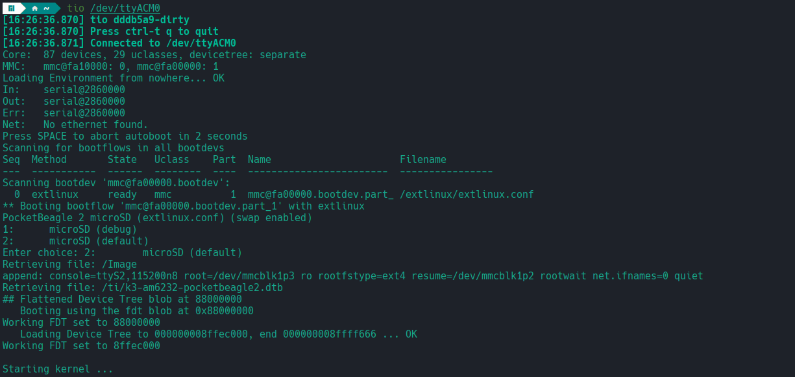

.. _pocketbeagle-2-quick-start:

Quick Start Guide
#################

This section provides instructions on how to hook up your board. This Beagle requires a 5V @ 1A (5W) 
power supply to work properly via either USB Type-C power adapter or via cape header pins. 

Recommended adapters can be found at :ref:`accessories-power-supplies` section.

.. _pocketbeagle-2-whats-in-the-box:

What’s In the Box
*****************

In the box you will find two main items,

* `PocketBeagle 2 <https://www.beagleboard.org/boards/pocketbeagle-2>`_
* Instruction card

.. note:: 
   
   A USB-C to USB-C / USB-A to USB-C cable is not included, but recommended for the tethered scenario and creates 
   a developer experience where the board can be used immediately with no other equipment needed.

.. tip:: 
   
   For board files, 3D model, and more, you can checkout 
   `PocketBeagle 2 repository on OpenBeagle <https://openbeagle.org/pocketbeagle/pocketbeagle-2>`_.

.. todo:: Add picture of PocketBeagle 2 box content

.. _pocketbeagle-2-software-updates:

Software Updates
****************

Follow instructions below to download the latest image for your PocketBeagle 2:

1. Go to `Beagleboard Imager <https://beagleboard.github.io/bb-imager-rs>`_ page.
2. Select board, image, drive and hit ``WRITE``.
3. Pop the sdcard into the card-slot on the back, with the pretty side facing out.
4. Power on your Beagle and let it rip!

.. important::
   | If you *do* set a hostname, please make sure it's **not** the same as the PC you plan to tether it to.
   |
   | Your network connection will not work correctly if you do.

.. tip::

   | If you connect to the debug port, you can select the ``copy microSD to eMMC`` option
   | to quickly update it once you're happy with the result.

To see what SW revision is loaded into the running software image, check `/etc/dogtag`.
It should look something like as shown in example below:

.. code-block:: shell

   root@BeagleBone:~# cat /etc/dogtag
   BeagleBoard.org Debian Trixie IOT Image 2026-02-12

Main Connection Scenarios
*************************

This section describes how to connect and power the board and serves as a slightly more detailed 
description of the quick start guide included in the box. The board can be configured in several 
different ways, but we will discuss the two most common scenarios.

1.  Directly tethered to a PC via pocketbeagle 2 USB-C port.
2.  With `TechLab Cape <https://www.beagleboard.org/boards/techlab>`_ or `GamePup Cape <https://www.beagleboard.org/boards/pocketbeagle-gamepup-cape>`_  for sensors, USB host, LEDs and Buttons.

.. _pocketbeagle-2-tethered-scenario:

Tethered Connection
===================

In this scenario, the board is directly connected to a PC via USB-C port. This is the simplest way to get started with the board.
Optionally you can connect rpi debug probe to 3-pin JST-SH connector to see boot log, board console access and for general debugging.

.. figure:: images/connection-diagrams/tethered-connection.*
   :align: center
   :alt: Tethered Connection

   Tethered Connection

USB connection
--------------

1. Connect the USB-C cable to the PocketBeagle 2 and the other end to the PC.
2. The board will power up and boot from the microSD card.
3. The board will show up as a USB device on the PC.
4. You can access the board via ``SSH`` or board ``serial`` connection or though ``Visual Studio Code Server`` web interface.

.. tab-set::
   .. tab-item:: Visual Studio Code Server

      After connecting the board to the PC, you can access the board via a web browser by entering the IP address of the board in the address bar.

      .. code-block:: text

         https://192.168.7.2:3000/

      .. figure:: images/misc/vscode-server.png
         :align: center
         :alt: Visual Studio Code Server

         Visual Studio Code Server

   .. tab-item:: SSH

      After connecting the board to the PC, you can access the board via SSH executing the following command in your terminal.

      .. code-block:: bash

         ssh <username>@192.168.7.2

      Where ``<username>`` is the username you selected during the microSD card flashing process.

      .. figure:: images/misc/ssh-connection.png
         :align: center
         :alt: SSH connection

         SSH connection

   .. tab-item:: Serial

      PocketBeagle 2 has a built-in UART debug connection. You can connect to the board console using a serial 
      console application (e.g. Putty) on the PC just like your would connection using any external UART debug probe

      If PocketBeagle 2 is the old device connected with UART, on linux you can use `tio` utility, replace ``ttyACMx`` with the actual device name.

      .. code-block:: bash

         tio /dev/ttyACMx

      .. figure:: images/misc/serial-connection.png
         :align: center
         :alt: Serial connection

         Serial connection

Once you have access to the console using any of the methods above, you might want to share internet connection with the board.
Do this by following the OS specific steps below:

.. tab-set::

   .. tab-item:: Linux

      First you have to identify your WiFi interface name and PocketBeagle 2 Ethernet interface name using following command,

      .. code-block:: bash

         ip a

      If you have your WiFi connected to router and PB2 connected to one of the USB the you should see four interfaces listed

      - 1: lo
      - 2: wlp0s20f3
      - 3: enp0s20f0u2
      - 4: enp0s20f0u2i2

      Out of which ``wlp0s20f3`` is the WiFi interface and ``enp0s20f0u2`` is the PocketBeagle 2 Ethernet interface. 
      
      Once you know the interface names, you have to create ``pc-internet.sh`` file on PC with the following content,

      .. code-block:: bash

         sudo sysctl net.ipv4.ip_forward=1
         sudo iptables --table nat --append POSTROUTING --out-interface wlp0s20f3 -j MASQUERADE
         sudo iptables --append FORWARD --in-interface enp0s20f0u1 -j ACCEPT

      make sure to update line 2 and 3 with your WiFi and PocketBeagle 2 Ethernet interface names. Then execute following commands,

      .. code-block:: bash

         chmod +x pc-internet.sh
         sudo ./pc-internet.sh

   .. tab-item:: Windows

      .. important::
         | Windows 10 is EOL and the usbncm driver support is non-functional.
         | You **will** need at least Windows 11 for this.

      | First you need to plug in your Beagle and give it a few moments to start.
      | You will be able to proceed when you see the following:

      .. figure:: images/misc/windows-networking.webp
        :align: center
        :alt: Network setup

      | Now, right-click on ``Ethernet 3``, choose Properties and select the ``Share`` tab.
      | Activate the first checkbox and select the usbncm network, in this case ``Ethernet 6`` from the dropdown.
      | The last checkbox is not important.

      | After confirming that the state of ``Ethernet 3`` has changed to **shared**,
      | you're ready to issue the following commands on the PB2 command-line:

      .. code-block:: bash

         sudo ip addr flush dev usb0
         sudo dhclient usb0

      After this, you can confirm that you can see the "outside world" by performing a ``ping``.

   .. tab-item:: MacOS

      .. note::
         | The following procedure was completed on Monterey (12.7.6),
         | but the UI should still display something similar today.

      | First you need to plug in your Beagle and give it a few moments to start.
      | Open **System Preferences** >> **Sharing**
      | You will be able to proceed when you see the following:

      .. figure:: images/misc/macos-networking.webp
        :align: center
        :alt: Network setup

      | First, make sure the network facing the Internet is selected in the dropdown.
      | Then select ``PocketBeagle2`` in the **To** pane,
      | and then lastly, click the **Internet Sharing** checkbox to enable the whole thing.

      | After confirming that the little "green led" turned on,
      | you're ready to issue the following commands on the PB2 command-line:

      .. code-block:: bash

         sudo ip addr flush dev usb0
         sudo dhclient usb0

      After this, you can confirm that you can see the "outside world" by performing a ``ping``.

UART serial debug connection
----------------------------

1. Connect the rpi debug probe to the 3-pin JST-SH connector on the board.
2. Connect the other end of the probe to the PC.
3. Use command line utility like `tio` with default setting or a serial console application (e.g. Putty) to accress your board.
4. You will see the boot log and can access the board console.

   Serial debug

.. _pocketbeagle-2-cape-scenario:

Cape Connection
===============

In this scenario, the board is connected to a cape like `TechLab Cape <https://www.beagleboard.org/boards/techlab>`_ 
or `GamePup Cape <https://www.beagleboard.org/boards/pocketbeagle-gamepup-cape>`_. This is the most common way to 
use the board for sensor interfacing, USB host, LEDs and Buttons. 

.. todo:: Add cape connection diagram and steps to use examples.

