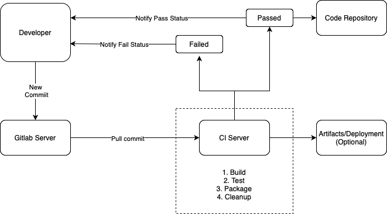

.. _intro-openbeagle-ci:

Introduction to OpenBeagle Continuous Integration (CI)
######################################################

OpenBeagle CI is a continuous integration system that automatically builds and tests the OpenBeagle project.
The CI system is designed to be scalable, modular, and open-source, allowing you to modify and contribute to the project.

What is CI and Why is it Important?
************************************

Continuous Integration (CI) is a software development practice where developers integrate code into a 
shared repository frequently, preferably several times a day. Each integration is verified by an automated 
build (including test) to detect integration errors as quickly as possible. By integrating regularly, you can detect errors 
quickly, and locate them more easily.

How to Get Started with OpenBeagle CI?
**************************************

To get started with OpenBeagle CI, you will need to add a ``.gitlab-ci.yml`` file at the root of your project.

A .gitlab-ci.yml file is a YAML file that defines the structure and order of the pipelines and jobs in your CI/CD process.

.. note::

    - Jobs: A job is a set of instructions that are executed by a runner. Jobs can include scripts, dependencies, and other configuration.
    - Pipelines: A pipeline is a set of jobs that are run in a specific order. Pipelines can be triggered by a commit, a schedule, or manually.

Here is an example of the ``.gitlab-ci.yml`` file used in `<https://docs.beagleboard.org>`_ 

Global Configurations: We define the global configurations for the pipeline.

.. code:: yaml

    image: registry.git.beagleboard.org/docs/sphinx-build-env:latest

    variables:
    GIT_SUBMODULE_STRATEGY: recursive

    cache:
    key: sphinx-build-env-docs-003
    paths:
    - .venv
    - .cache

- **image**: Specifies the Docker image to use for the job.
- **variables**: Sets the global environment variables for the pipeline.
- **cache**: Specifies the cache settings for the job. Helps in speeding up the build process. by reusing dependencies.

Build Job: This section defines the build job which helps in building the documentation.

.. code:: yaml

    build:
    stage: build
    tags:
    - docker-amd64
    parallel:
        matrix:
        - TARGET: [html, pdf]
    artifacts:
        paths:
        - public/$TARGET
    before_script:
        - source ./venv-build-env.sh
    script:
        - ./gitlab-build.sh $TARGET

- **build**: Defines the build job. This job builds the documentation.
- **stage**: Specifies the stage in which the job runs.
- **tags**: Specifies the tags for the job. Helpful in running the job on specific runners if needed.
- **parallel**: Specifies the parallel matrix for the job.
- **artifacts**: Files or directories that are saved after the job completes.
- **before_script**: Commands that are executed before the script.
- **script**: Commands that are executed during the job.

Pages Job: This job deploys the generated artifacts for public access (e.g., GitLab Pages).

.. code:: yaml

    pages:
    stage: deploy
    dependencies:
        - "build: [html]"
        - "build: [pdf]"
    tags:
    - docker-amd64
    script:
    - ./gitlab-build.sh publish
    artifacts:
        paths:
        - public
    except:
        - tags

- **pages**: Defines the pages job. This job deploys the documentation.
- **stage**: Specifies the stage in which the job runs.
- **dependencies**: Specifies the dependencies for the job.
- **tags**: Specifies the tags for the job.
- **script**: Commands that are executed
- **artifacts**: Files or directories that are saved after the job completes.
- **except**: Specifies when the job should not run.

Docs Job: This job deploys the generated artifacts for public access (e.g., GitLab Pages) only for tags.

.. code:: yaml

    docs:
    stage: deploy
    dependencies:
        - "build: [html]"
        - "build: [pdf]"
    tags:
    - docker-amd64
    script:
    - ./gitlab-build.sh publish
    artifacts:
        paths:
        - public
    only:
        - tags
    except:
        - branches

- **docs**: Defines the docs job. This job deploys the documentation only for tags.
- **stage**: Specifies the stage in which the job runs.
- **dependencies**: Specifies the dependencies for the job.
- **tags**: Specifies the tags for the job.
- **script**: Commands that are executed
- **artifacts**: Files or directories that are saved after the job completes.
- **only**: Specifies when the job should run.
- **except**: Specifies when the job should not run.

.. note::

    For more information on the GitLab CI/CD configuration keywords, visit `GitLab CI/CD Pipeline Configuration Reference <https://docs.gitlab.com/ee/ci/yaml/index.html>`_.

Recommended Reading
*******************

- `GitLab CI/CD Pipeline Getting started <https://docs.gitlab.com/ee/ci/>`_
- `GitLab CI/CD Runner <https://docs.gitlab.com/runner/>`_